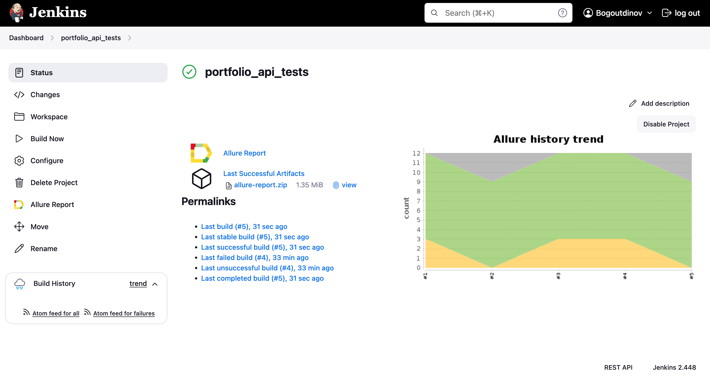

# Демо-проект по автоматизации тестирования API сайта [ok.surf](https://ok.surf/)

<p align="center">
  
</p>

## Содержание

* <a href="#cases">Реализованные проверки</a>

* <a href="#console">Запуск тестов из терминала</a>

* <a href="#jenkins">Запуск тестов в Jenkins</a>

* <a href="#allure">Отчет в Allure Report</a>

* <a href="#allure-testops">Интеграция с Allure TestOps</a>

* <a href="#telegram">Telegram уведомление</a>

<a id="cases"></a>
## Реализованные проверки

- [x] Позитивная проверка на статус код при получении списка новостей (CORS)
- [x] Позитивная проверка на статус код при получении списка новостей
- [x] Позитивная проверка на статус код при получении списка заголовков новостей (CORS)
- [x] Позитивная проверка на статус код при получении списка заголовков новостей
- [x] Позитивная проверка на статус код при получении списка новостей по определенным заголовкам
- [x] Негативная проверка на статус код при получении списка новостей (CORS)
- [x] Негативная проверка на статус код при получении списка новостей
- [x] Негативная проверка на статус код при получении списка заголовков новостей
- [x] Проверка параметра 'link' у запроса на получение списка новостей (CORS)
- [x] Проверка параметра 'title' у запроса на получение списка новостей
- [x] Проверка на JSON схему для заголовков новостей (CORS)
- [x] Проверка на JSON схему для заголовков новостей

<a id="console"></a>
## Запуск тестов из терминала

```bash
gradle clean test
```
<a id="jenkins"></a>
##  Запуск тестов в [Jenkins](https://jenkins.autotests.cloud/job/final_project_api/)

#### Главная страница Jenkins

<p align="center">
  
</p>

> Для запуска сборки необходимо нажать <code><strong>*Build Now*</strong></code>.

<a id="allure_report_and_allure_testops"></a>
#### Значки Allure Report и Allure TestOps

<p align="center">
  
</p>

<a id="allure"></a>
## </a> Отчет в [Allure Report](https://jenkins.autotests.cloud/job/final_project_api/allure/)

#### Главная страница Allure Report

<p align="center">
  
</p>

#### Тесты

<p align="center">
  
</p>

#### Графики

<p align="center">
  
</p>

<a id="allure-testops"></a>
## </a> Интеграция с [Allure TestOps](https://allure.autotests.cloud/launch/18515)

#### Тест-кейсы

<p align="center">
  
</p>

#### Дашборды

<p align="center">
  
</p>

<a id="telegram"></a>
## </a> Telegram уведомление

#### Оповещение о результатах сборки

<p align="center">
  
</p>